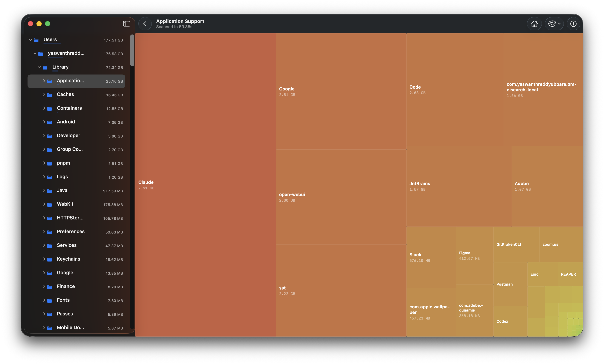
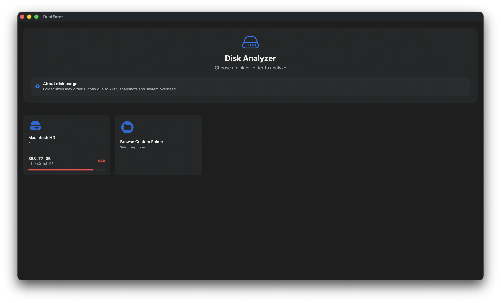
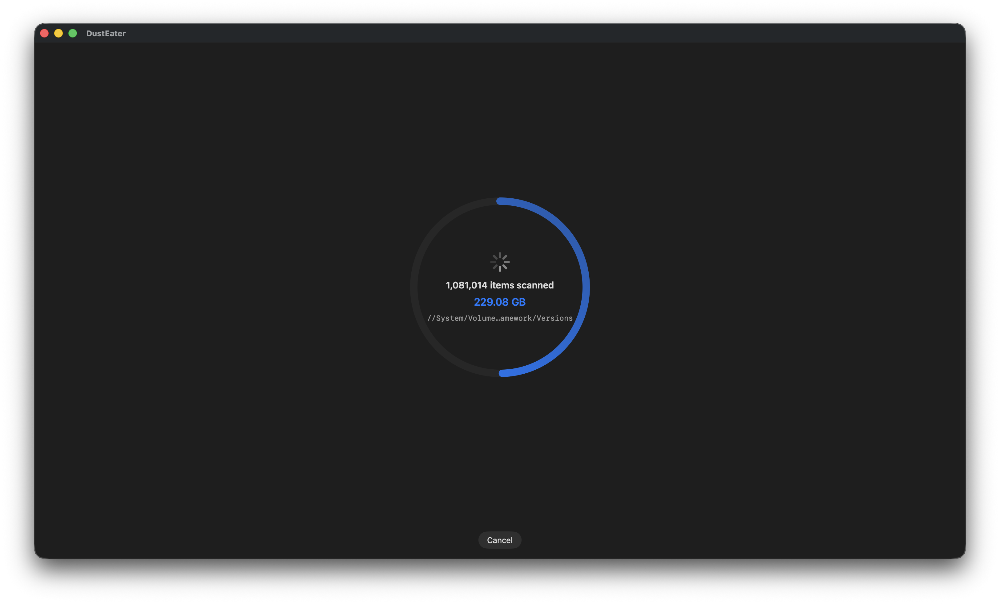

# DustEater

[](https://github.com/wireframe-sensei/DustEater/actions/workflows/ci.yml)
[](LICENSE)

A native macOS disk usage analyzer. Scan a volume or folder and see where the
space went in an interactive treemap - zoom into folders, inspect individual
files, and see app bundles rolled up with the data they leave behind in
`~/Library`.

Built with SwiftUI and AppKit, no external dependencies, distributed as a
Swift package.



<p align="center">
  
  
</p>

## Features

- **Fast recursive scanning** - uses `getattrlistbulk` with concurrent
  `TaskGroup`s rather than `FileManager` enumeration, so large volumes scan
  quickly.
- **Interactive treemap** - squarified treemap layout, click to zoom into a
  folder, hover for details, seven color themes (including a size-weighted
  green→red gradient).
- **App bundle grouping** - `.app` bundles are shown as one unit, with their
  actual footprint (caches, application support, logs, etc. in `~/Library`)
  cross-referenced and rolled into the bundle's true size rather than
  appearing as unexplained space elsewhere.
- **File details view** - click any file in the sidebar tree to see its type,
  size, and full path.
- **Native chrome** - real `NavigationSplitView` sidebar and unified toolbar,
  semantic system colors and materials throughout, and genuine Liquid Glass
  on macOS 26+ (falls back to a Material-based approximation on earlier
  systems - no separate build required).

## Download

Grab the DMG from the [latest release](https://github.com/wireframe-sensei/DustEater/releases/latest).
There's just the one download - it's a single universal binary (Apple
Silicon and Intel) that detects the OS at runtime: real Liquid Glass on
macOS 26+, and an equivalent Material-based appearance on macOS 14-25. You
don't need to pick a version for your system; the same DMG is correct
either way.

> [!NOTE]
> These builds are **unsigned** (no Apple Developer Program membership
> behind this project yet), so macOS Gatekeeper will flag the app as being
> from an unidentified developer, or say it's damaged. After dragging
> `DustEater.app` to Applications, either **right-click it → Open** (and
> confirm in the dialog that appears), or run:
> ```sh
> xattr -cr /Applications/DustEater.app
> ```
> This is a one-time step per download - it's not a sign of anything wrong
> with the app, just the standard consequence of shipping without a paid
> code-signing certificate.

## Requirements

- **To run it**: macOS 14 or later. The same binary renders real Liquid
  Glass on macOS 26+ and a Material-based equivalent below that - nothing
  extra needed either way.
- **To build it from source**: a Swift 6 toolchain (Xcode 16+). Note that
  which Xcode you build with matters for one thing specifically: the
  Liquid Glass code path only gets *compiled in* when built with Xcode 26+
  (it needs the macOS 26 SDK to exist at all, not just to run on it) - a
  build made with an older Xcode still works everywhere, it just never
  renders true glass, only the Material fallback, regardless of what OS
  it's later run on. This is why prebuilt releases (see Download, above)
  are the simpler way to get the real thing.
- **Full Disk Access.** DustEater runs unsandboxed so it can read arbitrary
  user directories; without Full Disk Access (System Settings → Privacy &
  Security → Full Disk Access) it can only scan folders the OS grants
  ordinary access to. The app will prompt you and link straight to the
  right settings pane if it hits a folder it can't read.

## Building and running

```sh
git clone https://github.com/wireframe-sensei/DustEater.git
cd DustEater
swift run DustEaterApp
```

Or open the folder in Xcode (`File → Open…`, select the package folder) and
run the `DustEaterApp` scheme.

### Other targets

The package also builds two command-line tools on top of the same scanning
engine, useful for benchmarking or scripting without the GUI:

```sh
swift run dustbench ~/Documents   # scan + report timing and top entries
swift run appsizes                # true install footprint of every app in /Applications
```

### Tests

```sh
swift test
```

## Project layout

```
Sources/
  DustEaterCore/   Scanning, the treemap layout algorithm, app-bundle
                    grouping, and byte formatting - no UI dependencies.
  DustEaterApp/     The SwiftUI/AppKit GUI.
  dustbench/        CLI: scan a path and report timing.
  appsizes/         CLI: true per-app disk footprint across /Applications.
Tests/
  DustEaterCoreTests/
```

`DustEaterCore` is a plain library target with no dependency on SwiftUI or
AppKit, so the scanning/layout logic is testable and reusable independent of
the GUI.

## Roadmap & Future Improvements

Planned enhancements and known deferred items:

- **Appearance-aware color themes** - add per-appearance (light/dark) variants
  of the six treemap color themes for better visual consistency across system
  appearance changes.
- **Pastel theme contrast fix** - improve white tile-label contrast on light
  tiles in the Pastel color theme.
- **Async tree sorting** - defer sorting until after the initial scan completes
  to improve scan responsiveness on very large volumes.
- **Export/reporting** - support exporting scan results to common formats
  (CSV, JSON) for analysis or sharing.

See [CLAUDE.md](CLAUDE.md) for notes on why certain items are deferred.

## License

MIT - see [LICENSE](LICENSE). One file
(`Sources/DustEaterCore/Treemap/YMTreeMap.swift`, Yahoo's squarified-treemap
algorithm) is used under its original Apache License 2.0 terms; see
[NOTICE](NOTICE) for the full text and attribution.

## Contributing

Issues and pull requests are welcome - see [CONTRIBUTING.md](CONTRIBUTING.md)
for setup, project layout, and PR guidelines. This project follows the
[Code of Conduct](CODE_OF_CONDUCT.md).
